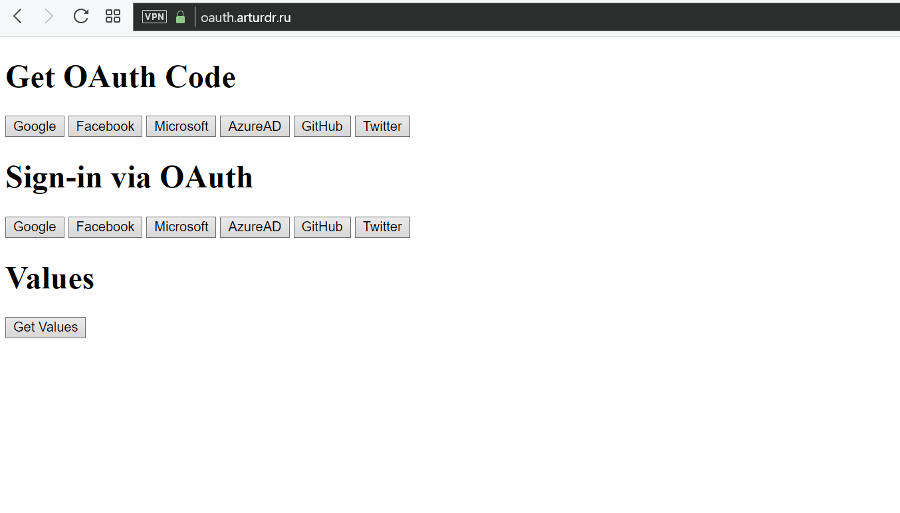

# OpenIddictExternalAuthentication
[](https://www.nuget.org/packages/Shaddix.OpenIddict.ExternalAuthentication/)
[](https://opensource.org/licenses/MIT)
[](https://dotnet.microsoft.com/en-us/download/dotnet/7.0)

Library that simplifies integration of [OpenIdDict](https://github.com/openiddict/openiddict-core) to a several lines of code.
It contain basic implementation of `AuthenticationController`, mostly taken from [OpenIddict Samples](https://github.com/openiddict/openiddict-samples).

## What's inside
1. Required endpoints to support 3rd party authentication (e.g. Google, Facebook, etc.)
2. JWT access_token/refresh_token generation (i.e. default `/connect/token` endpoint)
3. Refresh token flow
4. Authorization Code flow
5. Resource Owner Password Flow (disabled by default, could be enabled via configuration)
6. `EnableIdentityServerRefreshTokens()` option that eases the migration from IdentityServer (i.e., that RefreshTokens from IdentityServer will still work, if `PersistedGrants` table remains)
7. `app.UseOpenIdDictConversionMiddleware()` helps to support old clients when migrating from IdentityServer. It allows to do the following:
   1. Remove non-existing scopes
   2. Remove header authorization (if client_id/client_secret are passed in Form parameters)
   3. Remove client_secret for public clients (otherwise OpenIdDict complains)
   4. Change name of form parameters (e.g. `userName` -> `username`)

Here's the [vanilla js](https://oauth.arturdr.ru) or [react](https://oauth.arturdr.ru/react) demo of Google/Facebook authentication using OpenIddict on backend.
The page has several buttons to log in via different providers.


# How to

1. PREREQUISITE: it's implied, that openiddict is installed and configured in your project already (if it's not, head over to one of the [samples](https://github.com/openiddict/openiddict-samples)).
2. Install nuget to add the library to your project.
   ```
    dotnet add package Shaddix.OpenIddict.ExternalAuthentication
   ```

3. Create you own `AuthorizationController` by inheriting from `OpenIdAuthorizationControllerBase`. This could look like:
   ```csharp
   public class AuthorizationController : OpenIdAuthorizationControllerBase<IdentityUser, string>
   {
       public AuthorizationController(SignInManager<IdentityUser> signInManager,
        UserManager<IdentityUser> userManager,
        IOpenIddictClientConfigurationProvider clientConfigurationProvider) : base(signInManager, userManager,
        clientConfigurationProvider)
        {
        }

   }
   ```
4. Override some functions (e.g. `CreateNewUser` or `GetClaims`) if you want to customize user creation behavior or provide more claims.
5. From `Configure` function in `Startup.cs` add the following calls (in addition to standard OpenIddict setup):
   ```csharp
   services
      .AddOpenIddict()
      .AddOpenIddictConfigurations(Configuration)
      .AddDefaultAuthorizationController()
   ```
   You could customize default authorization controller configuration (or even default OpenIddict configuration) by doing:
   ```
   .AddDefaultAuthorizationController(options => 
                    options.DisableRefreshTokenFlow())
   ```
   or
   ```
   .AddDefaultAuthorizationController(options =>
                    options.OpenIddictServerBuilder.AllowNoneFlow())
   ```
8. Add external auth providers (i.e. `.AddAuthentication().AddGoogle()`, `.AddFacebook()`, etc.). Follow instructions on how to set up applications on [OAuth provider side](https://docs.microsoft.com/en-us/aspnet/core/security/authentication/social/facebook-logins?view=aspnetcore-5.0).

You could also take a look at [OpenIddictExternalAuthentication.Example](OpenIddictExternalAuthentication.Example) for example usage (keep in mind, that there are hardcoded ClientId/ClientSecret for FB and Google within Example app. They are for demo purposes and everyone can use them, so beware).

## Frontend
1. Use some proven openid client library (I personally recommend [oidc-client-ts](https://github.com/authts/oidc-client-ts)).
2. Use standard auth code flow according to the library instructions, pointing to standard Authorize endpoint and passing `?provider=Google` as a query parameter (i.e. authorization endpoint should look like `/connect/authorize?provider=Google`).
3. You could check example implementation in [plain-js](OpenIddictExternalAuthentication.Example/wwwroot/index.html) or [React](react-sample)

## External user storage
We use standard Asp.Net Identity mechanism to store external logins (namely, `AspNetUserLogins` table). To find a user by external OAuth id you need to use `_userManager.FindByLoginAsync(providerName, externalUserId)`

# FAQ
1. Error in browser: "The specified 'redirect_uri' is not valid for this client application."
   - Check `OpenIddictApplications` table and verify that `RedirectUris` field contains the URI you are redirecting to.
   - If URI is not there, check `RedirectUris` in `appsettings.json` for the respective application.
   - If problematic URI is a relative one, make sure that you called `options.SetPublicUrl()` with correct URL in `AddDefaultAuthorizationController` configuration callback.